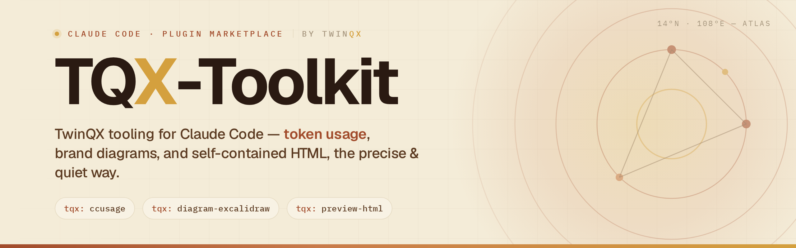
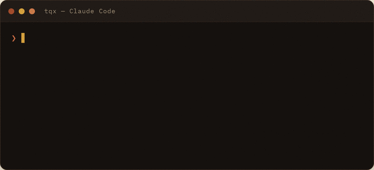

# tqx-tools — Claude Code plugin marketplace

[](https://github.com/quanap5/tqx-claude-plugins/actions/workflows/validate-plugins.yml)

<p align="center">
  
</p>

<p align="center">
  
</p>

A marketplace of TwinQX tooling for [Claude Code](https://code.claude.com). Everything ships as a
single plugin, **`tqx`**, whose skills are namespaced `tqx:`.

## Skills (in the `tqx` plugin)

| Skill | What it does |
|-------|--------------|
| `tqx:preview-html` | Build single-file, self-contained **TwinQX** HTML pages in the *Terracotta Atlas* visual system (warm Hỏa-Thổ palette, Geist + IBM Plex Mono, X-accented wordmark, dark product face for dashboards). |
| `tqx:ccusage` | Report Claude Code **token usage and cost per model** by daily / weekly / monthly / session / billing-block mode via the `ccusage` CLI. Auto-installs `ccusage` if missing (or falls back to `npx`), then summarizes the output. |
| `tqx:diagram-excalidraw` | Create **Excalidraw diagrams that argue visually**, styled in the **TwinQX** Terracotta Atlas brand (warm Hỏa-Thổ palette, no green/blue). Includes a Playwright render pipeline so the agent can see and fix its own output. Adapted from [coleam00/excalidraw-diagram-skill](https://github.com/coleam00/excalidraw-diagram-skill) (MIT). [See example →](plugins/tqx/skills/diagram-excalidraw/examples/) |

## Install

In Claude Code, add this marketplace once, then install the `tqx` plugin:

```text
/plugin marketplace add quanap5/tqx-claude-plugins
/plugin install tqx@tqx-tools
```

Or from the terminal (non-interactive):

```bash
claude plugin marketplace add quanap5/tqx-claude-plugins
claude plugin install tqx@tqx-tools
```

After install, each skill triggers automatically on intent — e.g. *"make a TwinQX landing page"*,
*"what's my Claude Code cost this month"*, *"vẽ sơ đồ kiến trúc excalidraw"* — or call one directly
as `tqx:preview-html`, `tqx:ccusage`, `tqx:diagram-excalidraw`.

> **Migrating from the old layout (v1.0.0):** this plugin replaces the former three separate
> plugins. If you installed `tqx-preview-html@tqx-tools` / `tqx-ccusage@tqx-tools` /
> `tqx-diagram-excalidraw@tqx-tools`, uninstall them and install `tqx@tqx-tools` instead.

## Update / remove

```text
/plugin marketplace update tqx-tools     # pull new versions
/plugin uninstall tqx@tqx-tools
/plugin marketplace remove tqx-tools
```

> Versions are pinned by the `version` field in `plugin.json` / the marketplace entry.
> **Bump `version` on every release**, otherwise existing users keep the cached copy.

## Repo layout

```
tqx-claude-plugins/
├── .claude-plugin/
│   └── marketplace.json              # the catalog (lists the tqx plugin)
└── plugins/
    └── tqx/
        ├── .claude-plugin/
        │   └── plugin.json           # the plugin manifest (name: "tqx")
        └── skills/
            ├── ccusage/
            │   └── SKILL.md          # tqx:ccusage — token/cost reporting
            ├── preview-html/
            │   ├── SKILL.md          # tqx:preview-html — branded HTML builder
            │   ├── assets/ (tokens.css, template.html)
            │   └── references/components.md
            └── diagram-excalidraw/
                ├── SKILL.md          # tqx:diagram-excalidraw — Excalidraw diagrams
                ├── references/       # render pipeline + color-palette
                └── examples/         # digital-twin-architecture
```

## Validate before pushing

```bash
claude plugin validate .
```

## License

MIT
