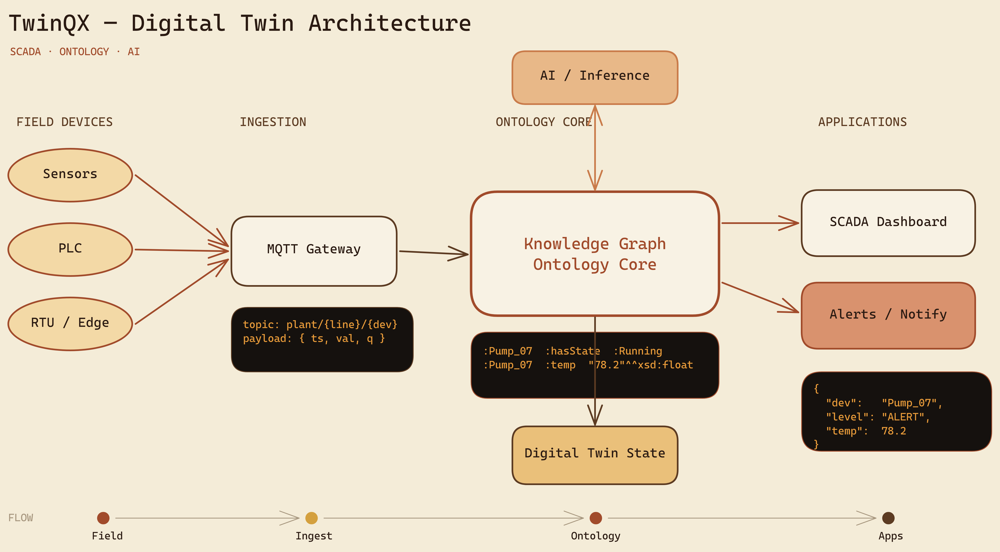

# Examples — tqx-diagram-excalidraw

Reference output produced by this skill, so you can see what a real diagram looks like.

## Digital Twin Architecture

A comprehensive technical architecture for a TwinQX digital-twin SCADA platform —
demonstrating the skill's core methodology in the Terracotta Atlas brand:

- **Pattern variety:** convergence (field devices → gateway), hub (ontology core as hero),
  bidirectional link (AI ↔ ontology), fan-out (core → applications).
- **Multi-zoom:** Level-1 summary strip + Level-2 section bands + Level-3 evidence artifacts.
- **Evidence artifacts:** real MQTT topic/payload, RDF triples, and alert JSON on the dark
  "Furnace Reactor" face (amber text — never green).
- **Brand discipline:** warm-only palette, zero green, zero blue.

- `digital-twin-architecture.excalidraw` — editable source (open at [excalidraw.com](https://excalidraw.com))
- `digital-twin-architecture.png` — rendered via the skill's Playwright pipeline (`render_excalidraw.py`)
